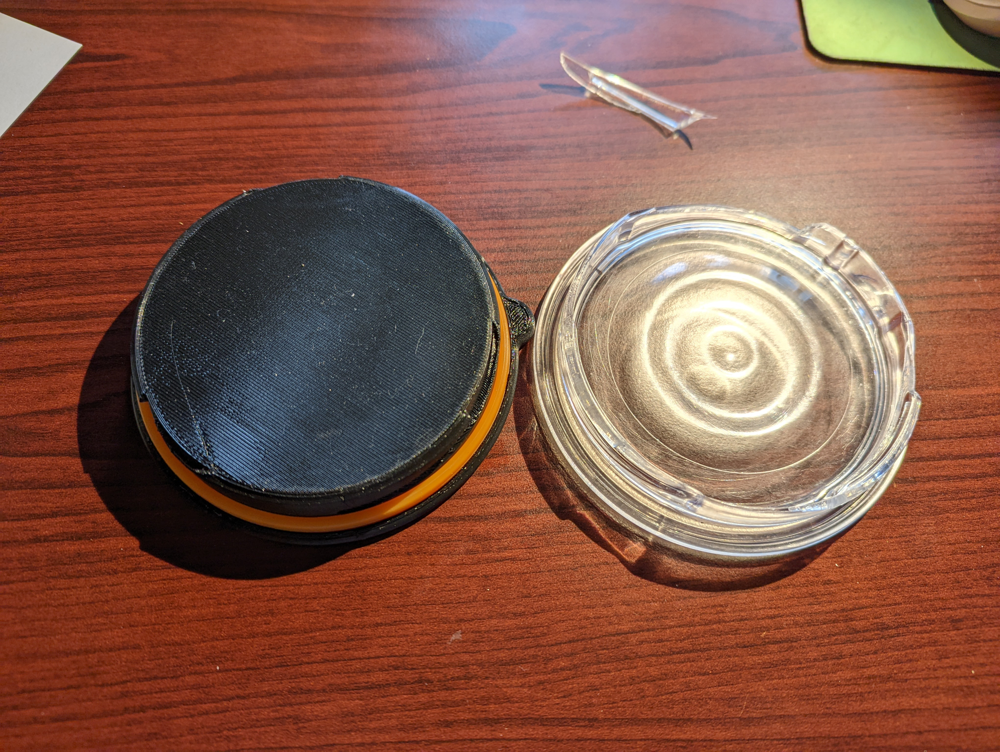

# LunchPotLid
A replacement lid for the LunchPot from Black+Blum. Coded in CadQuery.

As you can see, the old one broke. I decided to keep the new one solid rather than a shell, so as to be stronger against the failure mode of the original part.